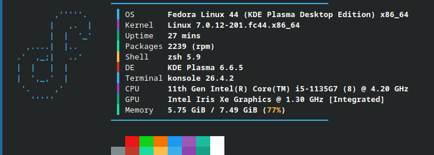

# Sxi Fastfetch Konfigürasyonu

BTT topluluğunun modern, renkli bloklu ve çizgili minimalist tasarımından esinlenerek hazırlanmış, tüm popüler Linux dağıtımlarıyla uyumlu evrensel Fastfetch teması.

<p align="center">
  
</p>

##  Özellikler
* **Dinamik Logo Desteği:** Dağıtımınız hangisiyse (Fedora, Arch, Ubuntu, openSUSE) onun küçük sürümünü otomatik olarak algılar ve tasarımı bozmaz.
* **Modern Renk Blokları:** Bilgilerin solunda şık ve minimalist dikey renk çubukları içerir.
* **Evrensel Kurulum:** Tek bir komutla paket yöneticinizi yormadan bağımlılıkları çözer ve kurulumu tamamlar.

##  Tek Komutla Kurulum

Aşağıdaki komutu kopyalayıp terminalinize yapıştırmanız yeterlidir. Kurulum betiği, dağıtımınızı otomatik tanıyıp gerekli konfigürasyonları yapacaktır:

```bash
curl -sSL https://raw.githubusercontent.com/Sxinar/fastfetch-config/main/install.sh | bash
